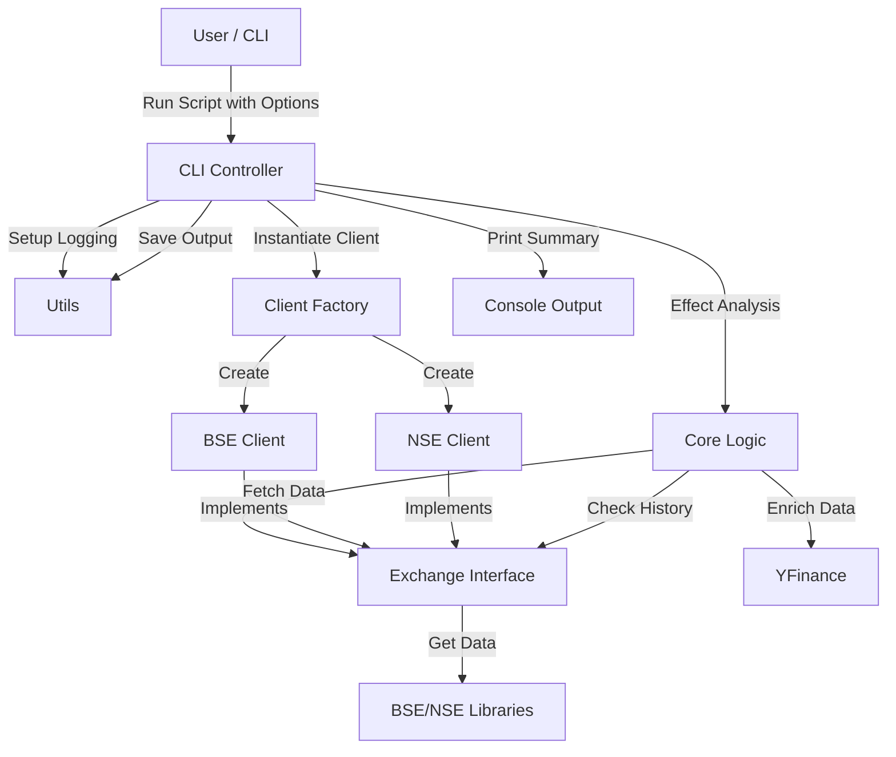

# Architecture

## High-Level Flow

## Modules

### `src/first_filings/exchange.py`
**Core Interface**: Defines the contract for all exchange interactions.
- `ExchangeClient` (ABC):
    - `fetch_announcements()`: Standardized fetching method.
    - `get_enrichment_info()`: Standardized symbol resolution.
- `Announcement` (Dataclass): Unified data model for announcements.

### `src/first_filings/bse_client.py`
**BSE Implementation**: Inherits from `ExchangeClient`.
- Wraps `bse` library.
- Handles pagination and category mapping.
- Implements `get_enrichment_info` using BSE lookup.

### `src/first_filings/nse_client.py`
**NSE Implementation**: Inherits from `ExchangeClient`.
- Wraps local `nse` library.
- Supports `equities` and `sme` segments.
- Implements keyword-based filtering for "Analyst Calls", "Press Releases", etc.

### `src/first_filings/core.py`
**Business Logic**: Agnostic of specific exchange.
- `FirstFilingAnalyzer`:
    - Accepts any `ExchangeClient`.
    - `fetch_announcements`: Delegates to client.
    - `is_first_filing`: Checks history via client to verify uniqueness.
    - `enrich_filing_data`: Enriches findings with Market Cap/Price using `yfinance`.

### `src/first_filings/cli.py`
**Entry Point**:
- Parses arguments (`--exchange`, `--period`, etc.).
- Instantiates appropriate client (BSE/NSE-Main/NSE-SME).
- Orchestrates the analysis loop.

## Data Models

### Announcement
Standardized object ensuring consistent processing across exchanges:
- `scrip_code`: str (Symbol/Code)
- `company_name`: str
- `date`: datetime
- `category`: str
- `description`: str
- `attachment_url`: str

## Output
JSON structure is normalized, regardless of the source exchange, ensuring downstream consumers can parse `bse_output.json` and `nse_output.json` identically.
