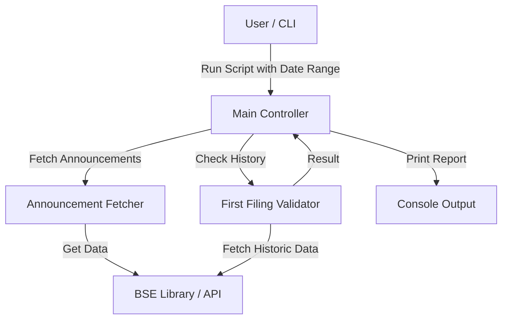

# Architecture

## High-Level Flow

## Modules

### `FirstFilingsBSE.py`
The single-file script containing all logic.

-   **`main()`**: Entry point. Parses arguments and orchestrates the flow.
-   **`fetch_paginated_announcements`**: Low-level wrapper around `bse.announcements` to handle pagination.
-   **`fetch_announcements_for_date`/`fetch_announcements_for_date_range`**: Aggregates announcements for configured categories.
-   **`is_first_filing`**: Core logic. Checks finding if a filing is unique in the lookback window.
-   **`parse_date_range`**: Utility to handle `-WTD`, `-MTD`, `-QTD` flags.

## Data Flow
1.  **Input**: Date range, Lookback period.
2.  **Process**: 
    -   Fetch all announcements for the target date(s).
    -   For each announcement, query historical data (lookback period) to see if a similar announcement exists.
3.  **Output**: List of companies with their "First Filing" of a certain type.
